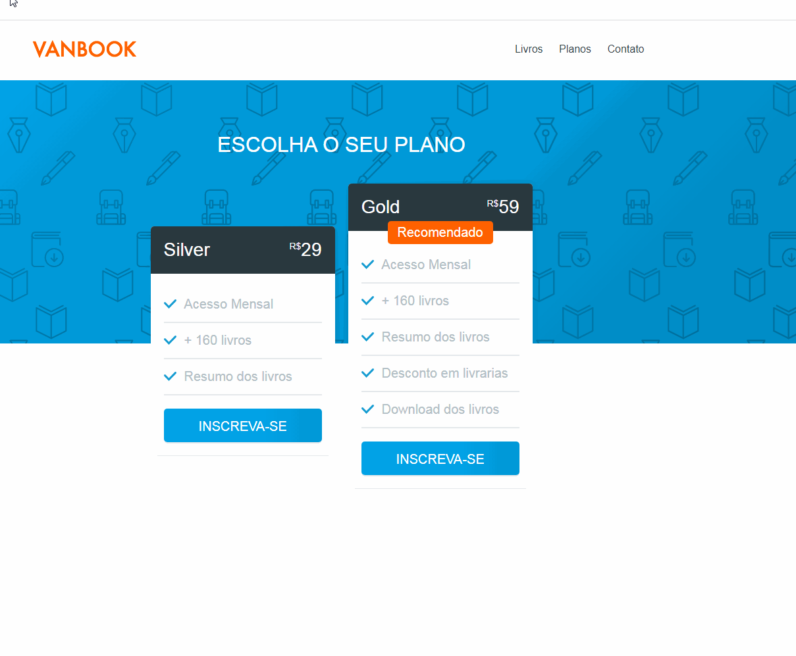

# Animação ao Scroll

## Introdução  
- Neste repositório aprensento projeto 
- Onde ocorre uma animação ao usar o Scroll.
- Tecnologias utilizadas, HTML, CSS, Javascript e Jquery
- Foi desenvolvido no baseado em projeto do curso
da Origamid.

	

